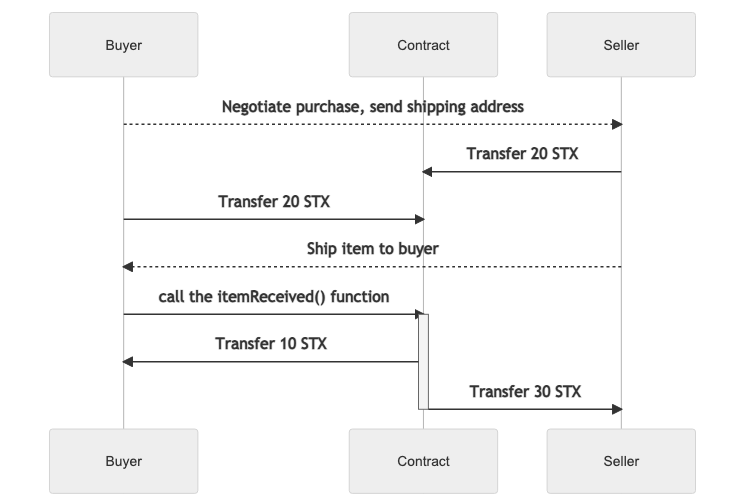

# Escrow Contract

* The Seller has an item that they want to sell
* The Buyer contacts the Seller (over email, phone call, etc.) and they agree on the price -- 10 STX
* The Seller transfers 20 STX to the smart contract (2x the price -- see below for why)
* The Buyer transfers 20 STX to the smart contract
* Seller ships the item to the Buyer
* Buyer tells the smart contract that they have received the item
* Smart contract sends 10 STX back to the Buyer
* Smart contract sends 30 STX to the Seller

Because all transactions are public, both parties can see the transfers of STX
to the smart contract.  Both parties can see that the other party is serious
about purchasing or selling the item, because they're willing to risk more
than the price of the item.  And, minus some fees, both parties get their
extra STX back.

Some things to consider (think of them as bonus points):

* How many users can use this smart contract?
* Can it be used to track the sale of multiple items?
* If the buyer backs out, how can the seller get their funds back?  Is there
  a way to add a "time limit" before both parties can be paid out?
