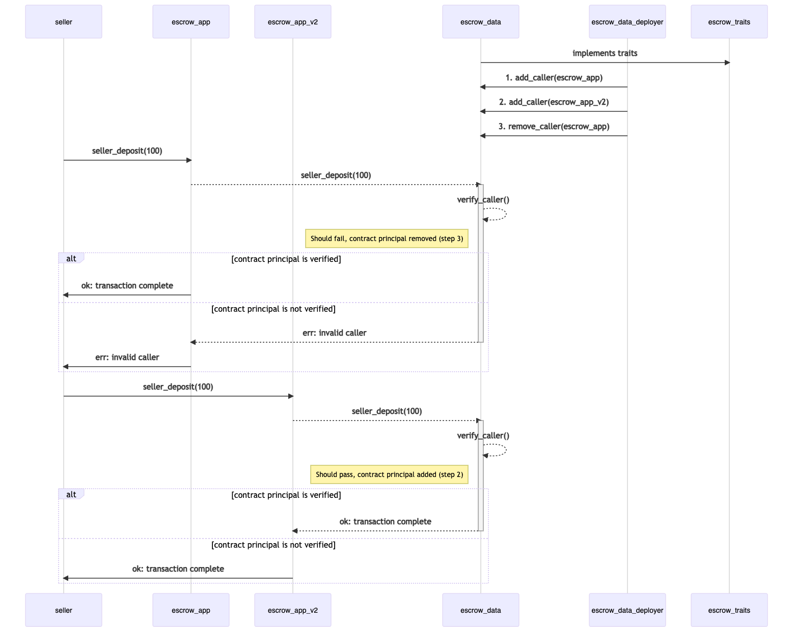

## Split App/Data contract example 

This example splits an escrow contract in to app and data contracts, where data contract holds all data and functions, while app contract provides a calling interface for buying or selling. The interface or traits are defined in a separate traits contract. 

Data contract has a bug which can be exploited by sellers. We will deploy a second app contract to fix this bug and also disable calls to first app contract, without making any changes in original data contract. 

### Files  

- **contracts/escrow-traits.clar** 
    - defines traits for app and data contracts   
- **contracts/escrow-data.clar**
    - escrow data contract which implements escrow-traits
- **contracts/escrow-app.clar**
    - escrow app contract which uses traits to call data contract
- **contract/escrow-app-v2.clar**
    - upgraded app contract that fixes bugs before calling data contract
- **tests/escrow-data_tests.ts**
    - contains test cases
    - shows how to disable calls from first app contract after v2 is deployed 

### Flow 

To understand the flow, lets first recap the escrow contract. 

The seller must deposit to show selling intent, then buyer does the same. Once the buyer recieves the item he/she can call item-received() and contract disperses the funds. 

#### **escrow-traits** 
Above three functions for escrow are defined as traits in our example. 

#### **escrow-data**
Data contract implements above three functions to conform with escrow-traits. It also contains a map of valid callers list which is controlled by contract deployer. 

#### **escrow-app** 
This contracts can or cannot be deployed by same data contract deployer. But data contract deployer needs to add app contract's principal in authorized list so it can call escrow-data contract. 
After this escrow-app can be used by buyers and sellers for purchaes. 

#### **escrow-app-v2**
Although escrow-data completely complies escrow-traits but its internal implementation has a bug which allows sellers to get funds without shipping items to buyers. This bug is fixed in escrow-app-v2. 

escrow-data contract deployer can also disable calls to escrow-app by removing it from authorized callers list. 

*Flow of a call is described as following*

