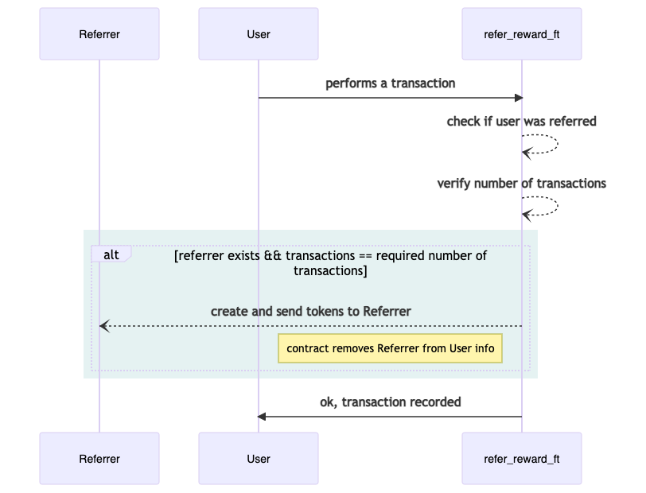

## Fungible tokens example

This example implements SIP10 fungible token trait to create referral rewards system. These reward tokens are transferred to referrers after new users complete sign-up process and perform certain number of transactions.

Example contains a contract and a SIP-10 FT trait.

### Files

- **contracts/ft-traits.clar**
    * defines traits for fungible tokens
- **contracts/refer-reward-ft.clar**
    * implements ft-traits for refer-reward tokens
    * offers functions like signup-by-referrer, complete-transactions
- **tests/\*.ts**
    * contains test cases

### Testnet deployment

| Contract        | Address                                                        |
| :-------------- | :------------------------------------------------------------- |
| ft-trait        | `ST2V7C1FR46HSV42S5XCZNJ80XE513E9526DGSC6E.ft-trait`           |
| refer-reward-ft | `ST2V7C1FR46HSV42S5XCZNJ80XE513E9526DGSC6E.refer-reward-ft-v6` |

### Flow

Existing users invite new users to system by registering their principal and email. The principal is saved on chain, while email is stored in app only. _[`signup-by-referrer`]_

Contract keeps one map of users to referrer principals and another for number of transactions performed by a user. _[`user-referrer`, `user-transactions`]_

After registration, users can perform transactions on app. Reward is only offered to referrer, if new user makes certain number of transactions. Details of transactions are out of scope of this example. Currently transaction number is set to 1. 

The app can check if the user has a referrer or not and then can call the function to automatically send the reward to referrer after the required number of transactions are performed by new user. _[`get-referrer`, `get-num-transactions`, `complete-transaction`]_ 

**_User registration by referrer_**

**_Self registration without referrer_**

**_Transactions and rewards flow_**

### Design key points

- One User can invite multiple new users and will be rewarded for each one
- A user cannot refer her/himself
- Once a referrer is rewarded for a new user, its principal is removed from new user's info map
- Transactions are not reverted if refer-reward fails for any reason
