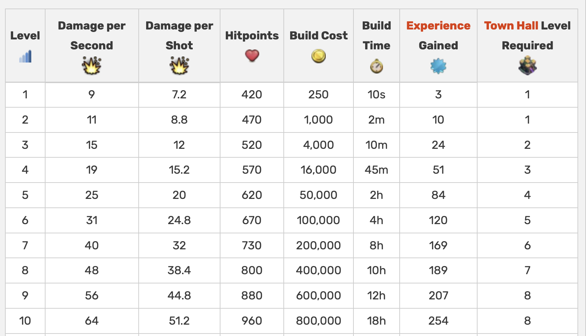

### Clash of Clans like game using SFTs

`coc.clar` contract uses `SIP-013` standard for defining multiple in-game currencies and commodities using a single SFT.

SFT trait and its implementation are copied from [here](https://github.com/MarvinJanssen/stx-semi-fungible-token).

Game has `gold, elixir & dark-elixir` currencies. Players can either buy these or earn with game-play. Players own `townhall, defenses, buildings, troops and heroes / warriors`. All of which can be upgraded using in-game currencies. Upgrade costs are defined as maps for each commodity. More complex upgrade rules can be added later.

### Clash of Clans - Gameplay

Clash of Clans is an online multiplayer game in which players form communities called clans, train troops, and attack other players to earn resources. There are four currencies or resources in the game. `Gold and elixir` can be used to build and `upgrade defenses` and to build and `upgrade buildings`. `Elixir and dark elixir` are also used to `train and upgrade troops` and spells.

A defense building e.g. `cannon` can be upgraded from `level 1 to 20`. Upgrade is done by spending `Gold`. Following table gives an overview of first 10 upgrades for `cannon`.

So from above table, upgrading cannon from level 5 to level 6 will cost 100,000 gold.

Other building like townhall require more than one type of currencies to upgrade, e.g. townhall 1 to 2 will cost both gold and elixir.

#### Copyrights

I used to play [Clash of Clans](https://supercell.com/en/games/clashofclans/) a lot. Its balanced economy and gameplay are really good. Code in this contract is loosely based on same concept. But this is just for learning and no copyright violation is intended.
